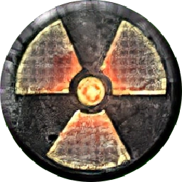

<h1 align="center">Welcome to the S.T.A.L.K.E.R. Devlopment Library</h1>

Welcome to the main repository for the S.T.A.L.K.E.R. Devlopment Library. The majority of the documentation available on the wiki is a result of a meticulous translation process from Russian and Ukrainian into English. This translation effort is crucial in bridging the language gap and making the wealth of information about the Xray Engine accessible to a broader international audience. By providing translations, the wiki ensures that developers, modders, and enthusiasts who may not be proficient in Russian or Ukrainian can still benefit from the insights, techniques, and knowledge shared within the community.

This multilingual approach not only fosters inclusivity but also promotes collaboration among a diverse group of individuals who share a common interest in understanding and working with the Xray Engine. The translated documentation serves as a vital resource for those outside the Russian and Ukrainian-speaking communities, allowing them to explore the intricacies of the engine, contribute to its development, and engage in the vibrant discussions that shape the modding and development landscape.

Moreover, the translation process underscores the global impact and appeal of the STALKER series and the Xray Engine. It facilitates a seamless exchange of ideas and expertise, fostering a sense of unity among individuals with a shared passion for exploring and modifying the capabilities of the engine, regardless of their native language. In essence, the wiki's commitment to translating documentation contributes significantly to the democratization of knowledge and the creation of a more interconnected and collaborative modding community.

**This wiki is not affiliated with GSC Game World or the developers, we are modders who want to help out other modders with working with STALKER.**

# Contributing

Our goal is to build this wiki up with as much information as possible, and your help is highly appreciated.

To contribute documentation first you'll need to fork the repo, if that sounds new to you then Github has a great page on it [here](https://docs.github.com/en/get-started/quickstart/fork-a-repo), it simply means you make a copy of our repo and from that you can make your own edits without affecting our repo.

Next you can view existing documents in the `_docs` folder for an idea of how to structure your tutorials and get an idea of how to lay it out, try and keep it professional but we're not looking for top quality, if we feel it's missing something we will fix it up. 

Next you'll need to edit the `toc.yml` file and add your document to it so it shows up in the sidebar. 

If you want to get an idea of what features you can use such as alerts check out the official [Docsy](https://github.com/vsoch/docsy-jekyll) repo.

Finally, you can file a pull request by going to the Pull requests tab which allows you to submit your changes, unless you break our guidelines or your contribution is a duplicate, we will more than likely take it on board!

We may split up your contribution if we feel it's too large, or we may marge it with existing documentation, but once your PR is submitted, we'll do the rest.

If you're finding it hard to follow all this but still want to contribute then you can open an issue or post in the Discord with your documentation, images, and assets and we'll handle the rest, but contributions made this way may take longer for us to add to the repo as time is limited.

# Credits

The main wiki is powered by the beautiful [Docsy for Jekyll](https://github.com/vsoch/docsy-jekyll) by [Vanessasaurus](https://github.com/vsoch).

# Supporting The Stalkers Development Library

Thank you for considering supporting The Stalkers Development Library! Your generous contribution helps us maintain and improve the wiki, ensuring that developers have access to valuable resources.

## Why Donate?

- **Sustain Development:** Your donations help us cover hosting costs, domain fees, and other expenses associated with maintaining the wiki.
- **Improve Content:** With your support, we can invest in creating more tutorials, documentation, and resources to aid developers using The Stalkers Development Library.
- **Community Growth:** Donations allow us to organize events, engage with the community, and foster a collaborative environment for developers.

## Ways to Donate

### Monthly Support

Consider becoming a monthly supporter and receive exclusive benefits:

- **Patreon:** [Become a Patron](https://patreon.com/STALKERDevelopmentLibrary?utm_medium=clipboard_copy&utm_source=copyLink&utm_campaign=creatorshare_creator&utm_content=join_link)

## Your Contribution Matters

Every contribution, big or small, makes a difference. We appreciate your support and dedication to The Stalkers Development Library. Thank you for being a part of our community!

